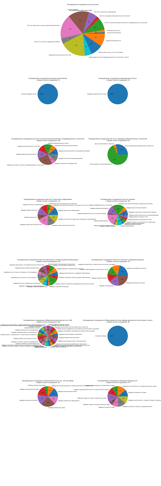

# kpfu_parser

сбор данных о количестве сотрудников в каждом из факультетов университета

#### результат работы:

#### как развернуть проект в своей среде:
1. вызовите в terminal `pip install -r requirements.txt`
2. установите в `constants.py` в переменной `gecko_path` путь к вашему `gecko_driver.exe`
